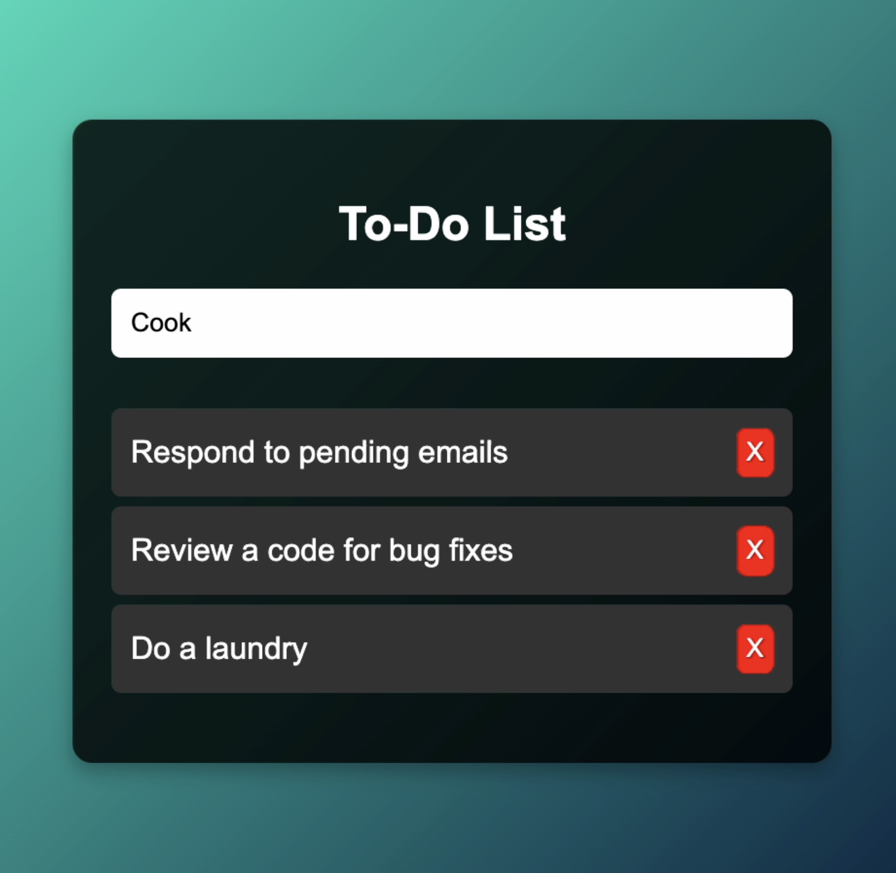

# Day 19 - To-Do List App with Drag & Drop

## 📋 Project Overview
Welcome to **Day 19** of my **30-Day Coding Challenge**!  
Today’s project is a **To-Do List App** with a twist — it comes with **drag-and-drop functionality**, allowing you to **reorder your tasks easily**. This is a **perfect productivity tool** and a fun way to practice DOM manipulation in JavaScript.

---

## ✨ Features
✅ Add new tasks easily  
✅ Drag and drop to rearrange tasks  
✅ Delete completed or unnecessary tasks  
✅ Fully responsive design  
✅ Simple, sleek UI for easy usability

---

## 🛠️ Technologies Used
- **HTML** for structure  
- **CSS** for styling  
- **JavaScript** for interactivity (drag & drop, adding/removing tasks)

---

## 📖 How to Use
1. Open the **index.html** file in your browser.
2. Type a task into the input field and click **Add Task**.
3. Reorder your tasks by dragging them into the desired order.
4. Remove tasks by clicking the **delete icon** next to each task.

---
# Demo page

Click [Here](https://ayshasanyang.github.io/Day-19-to-do-list/) to view the page

## 🚀 How to Run
1. Download or clone the repository
```bash
git clone https://github.com/ayshasanyang/Day-19-to-do-list.git
```
2. Navigate to the project folder.
3. Open the project files in your vscode or any code editor of your choice
4. Open the `index.html` file in your web browser.

---

## ✅ Use Case
This to-do list is useful for:  
✅ **Students** to track assignments and deadlines  
✅ **Professionals** to manage daily work tasks  
✅ **Content Creators** to plan their posts and ideas  
✅ Anyone who loves staying organized!

---

## 📸 Preview


---
Made with ❤️ by [AYSHA] 🚀